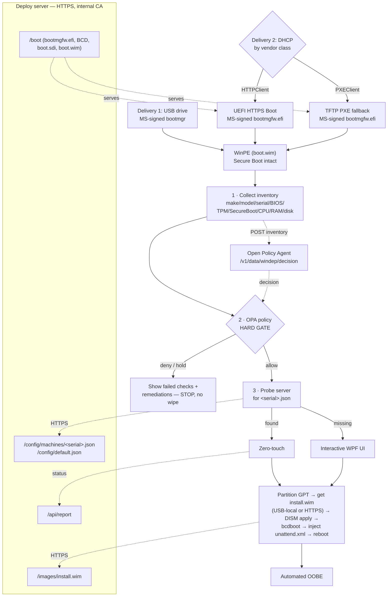

# WinDep — Windows 11 Deployment

A WinPE-based Windows 11 deployment solution with a **WPF UI** and **Zero-Touch Provisioning (ZTP)**.
The same WinPE image (`boot.wim`) can be delivered two ways, and once running it behaves identically:

1. **USB drive** — MS-signed `bootmgr` boots WinPE from the stick. `install.wim` can live on the stick or be pulled over HTTPS.
2. **Network** — via MS-signed `bootmgfw.efi`, so **Secure Boot stays ON** with no iPXE/shim/enrollment:
   - **UEFI HTTPS Boot** when the firmware supports it (encrypted boot transport to your internal CA).
   - **TFTP PXE fallback** when it doesn't (classic PXE, same as WDS).

Once WinPE is running, everything sensitive (config, `install.wim`, unattend, status) rides **in-WinPE HTTPS**
to your internal CA — never SMB.

---

## Transport model

The fleet requires **Secure Boot ON** and **internal-CA HTTPS**. Both are satisfied by using Microsoft's own
signed boot loader plus a phase split:

| Phase | Transport | Why it's safe |
|-------|-----------|---------------|
| Firmware → `bootmgfw.efi` (HTTPS-capable FW) | **UEFI HTTPS Boot** | Firmware does TLS to the internal CA; `bootmgfw.efi` is **MS-signed** so Secure Boot validates it. Encrypted + Secure Boot native. |
| Firmware → `bootmgfw.efi` (fallback FW) | **TFTP PXE** | Cleartext NBP, but still an **MS-signed** loader → Secure Boot validates. Same posture as standard WDS/SCCM PXE. |
| `bootmgfw` → BCD ramdisk → `boot.wim` | HTTP(S) or TFTP (matches the leg above) | Secure Boot validates `bootmgr`/`winload`/kernel in the WIM. |
| WinPE → config / `install.wim` / unattend / status | **HTTPS (internal CA)** | WinPE has the full schannel stack; the internal root CA is baked into the WinPE trust store at build time. |

**Routing** is a DHCP decision by client vendor class:
`HTTPClient` → hand out the HTTPS boot URL; `PXEClient` → hand out the TFTP NBP path.

**Residual risk (TFTP fallback only):** TFTP is cleartext with no integrity protection. Secure Boot still protects
the OS loader chain, but not the unsigned deploy scripts inside `boot.wim`. Mitigations: prefer HTTPS Boot where
firmware allows, run deployment on an **isolated provisioning VLAN**, and **bake no secrets into `boot.wim`** (it
holds only WinPE, the deploy scripts, the *public* root CA cert, and the server URL — secrets arrive only over the
in-WinPE HTTPS leg).

---

## Architecture



---

## Repository layout

| Path | Purpose |
|------|---------|
| `install.wim` | The Windows 11 Pro image (USB-local source). |
| `Build/Build-WinPE.ps1` | ADK automation: builds `boot.wim` (optional components + internal CA + `Deploy\*`), emits ISO/USB, stages the boot fileset for HTTPS/TFTP. |
| `Deploy/` | Everything injected **into** `boot.wim`. |
| `Deploy/startnet.cmd` | WinPE bootstrap → launches the WPF UI (falls back to `deploy.cmd`). |
| `Deploy/DeployEngine.psm1` | Core engine: identity, partition, HTTPS download, DISM apply, bootfiles, unattend. Shared by UI and ZTP. |
| `Deploy/DeployUI.ps1` + `DeployUI.xaml` | The WPF GUI. |
| `Deploy/Invoke-Deploy.ps1` | Top-level orchestrator (interactive vs zero-touch, headless). |
| `Deploy/Get-ZtpConfig.ps1` | Machine identity + HTTPS config pull + status report. |
| `Deploy/Get-Inventory.ps1` | Collects hardware/firmware inventory (make/model/serial/BIOS/TPM/SecureBoot/CPU/RAM/disk/net). |
| `Deploy/Invoke-Policy.ps1` | Submits inventory to OPA and normalizes the decision (fail-closed). |
| `Schema/inventory.schema.json` | JSON Schema for the inventory / OPA `input`. |
| `Server/policy/windep.rego` | Sample OPA policy (allowed models, min RAM/disk/BIOS, Secure Boot, TPM 2.0). |
| `Deploy/unattend.template.xml` | Tokenized OOBE automation. |
| `Deploy/ztp.config.json` | Server URL + defaults. **Editable on the USB** so you can repoint without rebuilding WinPE. |
| `Deploy/deploy.cmd` | Original text-mode deploy — kept as a break-glass fallback. |
| `Server/` | Sample HTTPS server content, boot fileset staging, and hosting/DHCP guidance. |

---

## Data collection & policy gate

Before any disk is touched, every boot runs an **inventory → policy** phase:

1. **Collect** — [`Get-Inventory.ps1`](Deploy/Get-Inventory.ps1) reads make, model, serial, asset tag,
   chassis, BIOS vendor/version/date, firmware type (UEFI/BIOS), Secure Boot state, TPM presence/version,
   CPU, RAM (+ DIMMs), disks (NVMe/SSD/HDD), and NICs into an object matching
   [`inventory.schema.json`](Schema/inventory.schema.json). It's saved to `X:\Windows\Temp\inventory.json`.
2. **Evaluate (hard gate)** — the inventory is POSTed over HTTPS to **Open Policy Agent** as the Rego `input`.
   `allow` proceeds; `deny`/`hold` **stops** and shows the failed checks + required remediations (e.g. "Update
   BIOS to ≥ 1.28.0", "Enable Secure Boot"). **Fail-closed:** if OPA is unreachable, the configured
   `policyFailAction` (default `hold`) blocks — no wipe without an explicit `allow`.
3. **Route** — on `allow`, continue to the per-machine config probe (zero-touch vs interactive).

Configure via [`ztp.config.json`](Deploy/ztp.config.json) (`policyUrl`, `policyFailAction`) and author rules in
[`Server/policy/windep.rego`](Server/policy/windep.rego) — see [`Server/policy/README.md`](Server/policy/README.md).
Policy may also return an optional `config` object to *steer* deployment (name/disk/image/unattend), not just gate it.
Leave `policyUrl` empty to disable the gate during early rollout.

## Operator runbook

### One-time: build the boot media
1. Install the **Windows ADK** + **WinPE add-on**.
2. Export your **internal root CA** to a `.cer` and note the path.
3. From an elevated *Deployment and Imaging Tools Environment* prompt:
   ```powershell
   .\Build\Build-WinPE.ps1 -RootCaCert C:\certs\InternalRootCA.cer `
                           -ServerUrl https://deploy.jhics.org `
                           -OutputIso C:\out\WinDep.iso
   ```
   Produces `WinDep.iso` (USB) and stages `bootmgfw.efi` / `BCD` / `boot.sdi` / `boot.wim` under
   `Server\wwwroot\boot\` for HTTPS + TFTP network boot.
4. For USB-local imaging, copy `install.wim` to the USB root. Write the ISO with Rufus (**DD / GPT / UEFI**) or
   `Build-WinPE.ps1 -UsbDrive E`.

### One-time: stand up the deploy server + DHCP
See [`Server/README.md`](Server/README.md): host `Server/wwwroot` over **HTTPS** (cert chaining to your internal CA),
serve the `/boot` fileset over HTTPS **and** TFTP, and configure your existing **DHCP** to route by vendor class
(`HTTPClient` → HTTPS boot URL, `PXEClient` → TFTP NBP).

### Per machine
- **Interactive:** boot (USB or network) → pick disk + name in the WPF UI → confirm → deploy.
- **Zero-touch:** boot → agent reads the serial → pulls `machines/<SERIAL>.json` (or `default.json`) → deploys with
  no prompts → reboots into automated OOBE.

---

## Validation status

Written to be runnable but **not yet booted on hardware from this environment** — validate with your ADK + a WinPE
VM/machine. Suggested order: (1) `Build-WinPE.ps1` mounts/unmounts cleanly, (2) WinPE boots to the WPF UI in a VM,
(3) interactive deploy to a scratch disk, (4) ZTP against a test `default.json`, (5) UEFI HTTPS Boot, then the TFTP
fallback. Each script carries a validation checklist in its header.

---

## License & contributing

Licensed under the **Apache License 2.0** — see [`LICENSE.md`](LICENSE.md) and [`NOTICE`](NOTICE).
Contributions are accepted under the **Developer Certificate of Origin (DCO) 1.1**; sign off every commit
(`git commit -s`), follow [Conventional Commits](https://www.conventionalcommits.org/), and see
[`CONTRIBUTING.md`](CONTRIBUTING.md) and [`CONTRIBUTORS.md`](CONTRIBUTORS.md). Notable changes are tracked in
[`CHANGELOG.md`](CHANGELOG.md).
